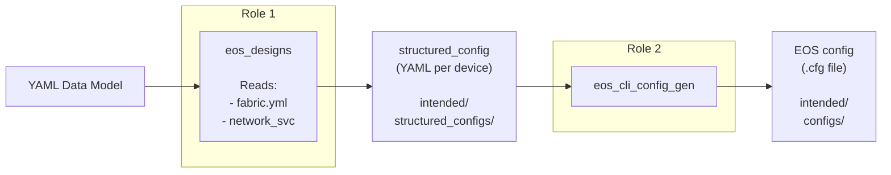

# AVD Workshop — Agenda

> **Goal:** Understand the AVD-based workflow, get hands-on with a lab, learn the git-based change process
>
> **Prerequisites:** Complete all steps in the [README](../README.md) before the workshop

---

## Theory & Demos

### Tour of the Production Repo (Demo)

**Walk through the production repo structure:**

```text
avd-sh/
├── inventory.yml          ← What devices we manage
├── group_vars/
│   ├── FABRIC/
│   │   ├── ansible.yml    ← How to connect (eAPI)
│   │   ├── l3spine.yml    ← Spine definitions (4 spines, 2 pods)
│   │   ├── l3leaf.yml     ← Leaf definitions (10 leaves, 5 groups)
│   │   ├── p2p_links.yml  ← Underlay point-to-point links
│   │   ├── bgp.yml        ← BGP settings (eBGP underlay + overlay)
│   │   └── common.yml     ← AAA, NTP, DNS, banners, ACLs
│   ├── SPINES.yml         ← type: l3spine
│   └── LEAVES.yml         ← type: l3leaf
├── build.yml              ← Playbook: generate configs
├── deploy.yml             ← Playbook: push to digital twin
├── clab/                  ← Containerlab topology (16 nodes!)
└── makefile               ← Simple commands: build, preview, twin, lab
```

**Key takeaways:**

- **Inventory** defines _what_ devices exist and how to reach them
- **group_vars** define _what_ each device should look like (the data model)
- **Playbooks** are short — all the logic lives in the AVD roles
- **makefile** wraps everything so you never need to remember ansible flags
- Show `intended/configs/` — the generated EOS configs are readable, full configs
- Show `documentation/` — AVD auto-generates topology docs

**Deep dive into key files:**

- Open `l3leaf.yml` — show YAML anchors, node groups, per-leaf BGP AS
- Open `common.yml` — show how AAA, NTP, banners map to what they see in `show running-config`
- Open `p2p_links.yml` — show how 22 underlay links are defined with IPs and ASNs
- Open `clab/topology.clab.yaml` — 16 nodes, interface mappings, the full digital twin

---

### How AVD Works Under the Hood (Talk + Demo)

**The 2-role pipeline:**



1. **`eos_designs`** — reads your data model (fabric, network services, etc.) and produces a structured YAML config per device
2. **`eos_cli_config_gen`** — takes that structured YAML and renders it into actual EOS CLI config

**Demo: run `make build`, then show:**

- Input: `group_vars/FABRIC/fabric.yml` (~40 lines defining 2 spines + 2 leaves)
- Intermediate: `intended/structured_configs/leaf-01.yml` (hundreds of lines of structured data)
- Output: `intended/configs/leaf-01.cfg` (complete EOS running config)

**Key insight:** You only edit the high-level YAML. AVD handles:

- IP addressing (P2P links, loopbacks, VTEP)
- BGP configuration (underlay + overlay peering)
- VXLAN mapping
- Interface descriptions
- Route maps and prefix lists

**Production comparison:**

- Show how the production `l3leaf.yml` uses `structured_config` overrides and YAML anchors for things AVD doesn't auto-generate (VRF INET, custom peer groups, sub-interfaces)
- This is the escape hatch — AVD generates the base, `structured_config` lets you bolt on anything custom

---

### Containerlab & Git Workflow (Talk + Demo)

**Containerlab:**

- cEOS containers — real EOS, real CLI, real control plane
- Define topology in YAML — nodes and links
- `clab deploy` → 4 switches running in seconds
- Management network for eAPI access — same deployment path as production
- **Digital twin**: test your configs before touching production

**The change workflow:**

```text
1. git checkout -b feature/add-vlan-130     ← Create a branch
2. Edit network_services.yml                 ← Make your change
3. make build                                ← Generate configs
4. make preview                              ← See the diff (what would change)
5. make twin                                 ← Deploy to digital twin
6. Verify on switches                        ← Check BGP, VXLAN, ping
7. git add + git commit                      ← Save your change
8. git push + create PR                      ← Review by team
9. Merge → make release                      ← Deploy to production (CloudVision)
```

**Demo: walk through a real change on the production repo:**

- Show `git log --oneline` — each commit tells a story
- Show a PR diff — reviewer sees exactly what YAML changed and what configs changed
- Show the CI pipeline (`ci.yml`) — `make build` runs on every PR automatically

**Production deploy path:**

- `make twin` → eAPI to containerlab (digital twin)
- `make release` → CloudVision workspace → pending approval → change control

---

## Hands-on Labs

> See **LAB_GUIDE.md** for detailed step-by-step instructions.
>
> The fabric topology is pre-configured. Engineers explore it, then extend it with services.

### Exercise 1: Orientation — Project Structure & Build Pipeline (Hands-on)

**What they learn:** How all the project files link together and what AVD generates from them.

- Read through `inventory.yml`, `group_vars/FABRIC/`, `SPINES.yml`, `LEAVES.yml`, and `clab/topology.clab.yaml`
- Follow the comments in each file to understand how `fabric_name`, `type`, and the topology keys connect
- Run `make build` — see how ~50 lines of topology YAML produces hundreds of lines of generated config
- Deploy to the digital twin, verify BGP peering and VXLAN — the "wow" moment

---

### Exercise 2: Base Config — NTP, DNS, Timezone (Hands-on)

**What they learn:** The YAML → build → deploy → verify cycle, using the AVD docs to find the right keys.

- Look up `ntp_settings`, `dns_settings`, and `timezone` in the AVD docs
- Add them to `fabric.yml`, build, deploy, verify
- First hands-on change through the full cycle

---

### Exercise 3: Network Services — VRF + VLANs (Hands-on)

**What they learn:** Creating network services from scratch — tenants, VRFs, VLANs, SVIs.

- Create `network_services.yml` from scratch
- Add tenant, VRF_A, VLANs 110/120 with SVIs
- Build, deploy, verify VXLAN VNIs, VRF routing, SVIs

---

### Exercise 4: Change Workflow — Add VLAN 130 (Hands-on)

**What they learn:** The full change lifecycle: edit YAML → build → preview → deploy → verify.

- Add VLAN 130 to existing `network_services.yml`
- `make build` → `make preview` → `make twin`
- `make preview` shows only leaf configs changed

---

### Exercise 5: Git Workflow (Hands-on)

**What they learn:** Feature branches for network changes — the same workflow used in production.

- Create a feature branch, add VLAN 140, build, commit
- Review branch history with `git log --oneline --all --graph`
- Discuss: push → PR → CI runs `make build` → team review → merge → deploy

---

### Bonus: Add a Second VRF (Hands-on)

**What they learn:** How AVD maps tenants, VRFs, and SVIs — extending the fabric with VRF_B.

- Add VRF_B with VLANs 210 and 220 to `network_services.yml`
- Build, deploy, verify both VRFs are operational and independent
- Confirm VRF_A is unaffected

**Q&A wrap-up:**

- Recap the workflow: YAML → build → preview → twin → verify → commit → PR → release
- Resources: AVD documentation, this repo, Containerlab docs
